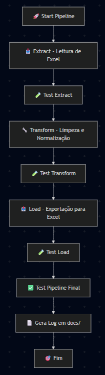

# 🚀 Pipeline ETL Modular com Testes Intermediários e Logging

## ✅ Descrição do Projeto

Este projeto implementa um **pipeline ETL modular** em Python, dividido em três etapas principais:

- **Extract 📥**: leitura e concatenação de múltiplos arquivos Excel.
- **Transform 🔧**: limpeza e normalização dos dados, exportação para Parquet.
- **Load 📤**: leitura de Parquet e exportação final para Excel.

Após cada etapa, o pipeline executa **testes unitários 🧪** com `pytest`.  
No final, executa um **teste de integração ✅** que valida o sucesso global.

Todos os eventos são registrados em um **arquivo de log** gerado automaticamente na pasta `docs/`, com nome no formato: docs/log_YYYYMMDD_HHMMSS.log  

---

## ✅ Como rodar o pipeline
1. Clone o repositório: git clone <URL>
2. Acesse o dir: cd <diretório>
3. Instale as dependências: pip install -r requirements.txt
4. Execute o pipeline: python -m app.main

Como rodar os testes separadamente
Todos os testes usam pytest. Para rodar:

Todos de uma vez: pytest
Individualmente:
pytest tests/test_extract.py
pytest tests/test_transform.py
pytest tests/test_load.py
pytest tests/test_pipeline.py

Estrutura do Diretório

.
├── app
│   ├── __init__.py
│   ├── main.py
│   └── pipeline
│       ├── __init__.py
│       ├── extract.py
│       ├── transform.py
│       └── load.py
├── data
│   ├── input/
│   └── output/
├── docs/
│   ├── log_YYYYMMDD_HHMMSS.log
├── tests
│   ├── test_extract.py
│   ├── test_transform.py
│   ├── test_load.py
│   └── test_pipeline.py
├── requirements.txt
├── pytest.ini
└── README.md

Tecnologias utilizadas
Python 3.11+
pandas: manipulação de dados.
pyarrow: leitura e escrita Parquet.
pytest: testes automatizados.

Fluxo do Pipeline
Extract 📥 → Teste 🧪
Transform 🔧 → Teste 🧪
Load 📤 → Teste 🧪
Teste Final ✅
Log gerado 📄
FIM 🎯

requirements.txt
pandas>=1.0
pyarrow>=9.0
pytest>=7.0

#########################

Agora você tem:
✅ Pipeline robusto
✅ Testes intermediários
✅ Logs completos
✅ Documentação top!
✅ requirements.txt

Entrega deste projeto: Este projeto entrega um pipeline ETL completo e profissional, seguindo as melhores práticas de Engenharia de Dados, com foco em:
✅ Modularidade — cada etapa separada com responsabilidade única: Extract, Transform e Load.
✅ Testabilidade — testes automatizados com pytest em cada etapa, garantindo qualidade e segurança na evolução do código.
✅ Observabilidade — sistema de logging estruturado, com geração automática de arquivos de log identificados por data e hora, permitindo rastreabilidade completa de cada execução.
✅ Automação — execução sequencial e validada de todo o processo, com parada imediata em caso de falha, evitando propagação de erros.
✅ Documentação clara — orientações objetivas sobre execução, estrutura do projeto e fluxo de dados, facilitando manutenção e escalabilidade.
✅ Estética e usabilidade — enriquecido com emojis e mensagens amigáveis para tornar a execução mais visual e intuitiva.

✅ Principais características técnicas:
🔒 Segurança e Controle:
Validação automatizada de cada etapa via testes unitários com pytest, assegurando que falhas sejam identificadas e tratadas de forma imediata e controlada.
Arquitetura defensiva: o pipeline interrompe automaticamente a execução em caso de erro, evitando propagação de inconsistências.

🛠️ Robustez e Escalabilidade:
Estrutura modular orientada a funções específicas, garantindo manutenibilidade e facilidade de extensão para novos requisitos ou integrações.
Logging estruturado, com timestamp de execução e status de cada etapa, viabilizando rastreabilidade completa e facilitando auditorias.

📊 Observabilidade e Transparência:
Todos os eventos e operações são registrados em logs persistentes, gerados automaticamente e armazenados em docs/, permitindo uma visão clara da execução e apoio a processos de compliance e forense.

🚀 Entrega de Valor:
Automação de todo o fluxo ETL: desde a ingestão até a exportação dos dados tratados e validados, com garantias explícitas de qualidade e confiabilidade.
Mitigação de riscos operacionais com testes intermediários, evitando a entrega de dados corrompidos ou incompletos.
Preparação de dados em formatos otimizados (Parquet e Excel), prontos para análise, reporting ou integração com sistemas de inteligência.

## ✅ Diferenciais Técnicos
- Modularização completa por responsabilidade.
- Testes intermediários automatizados.
- Logging estruturado e persistente.
- Fail-fast: interrupção imediata em caso de falha.
- Preparado para expansão e orquestração.

"Este pipeline não apenas executa, mas valida, registra e garante a qualidade dos dados de ponta a ponta, conforme as melhores práticas de Engenharia de Dados."

